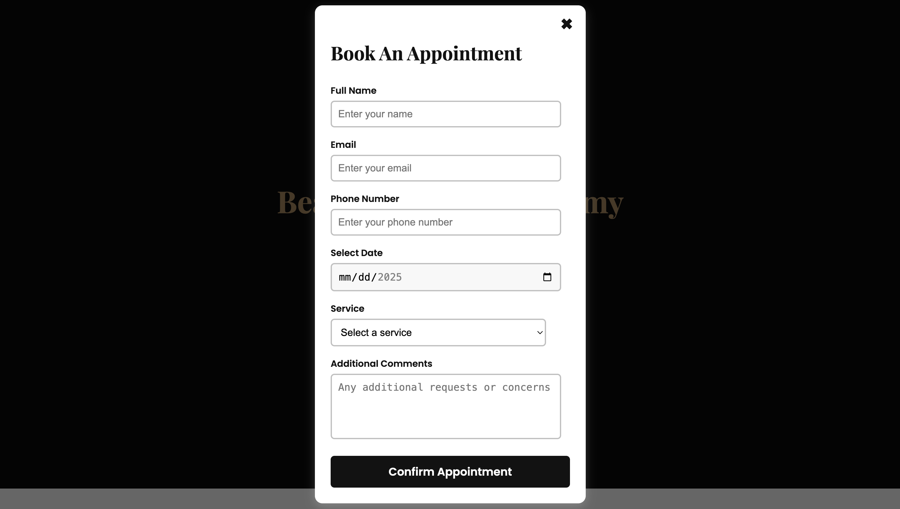
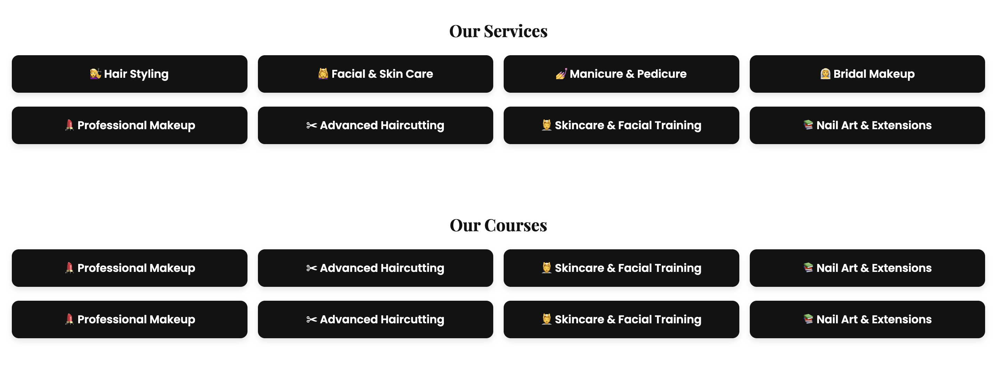
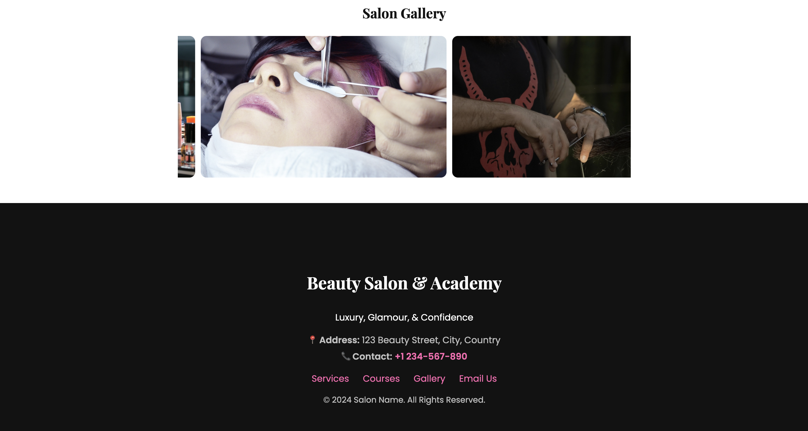

# 💇‍♀️ AI-Powered Salon Website with Appointment Booking & Hairstyle Recommendations

🚀 An interactive, AI-enhanced salon booking system designed for a seamless customer experience with:
- ✔ AI-powered hairstyle recommendations personalized for each user
- ✔ Online appointment scheduling with automated data handling
- ✔ A sleek, responsive UI with an animated salon gallery

This project blends AI, modern web technologies, and intuitive design to showcase expertise in Product Management, Technical Program Management (TPM), and Front-End Development.

---

# 🌟 Website Showcase
Here are some screenshots of the website in action:









---

## 📂 Technologies Used

### 🔹 Front-End:
- **HTML5** → For structuring the web pages 📑
- **CSS3** → For styling and responsiveness 🎨
- **JavaScript (ES6+)** → For interactivity and logic 🛠

### 🔹 Back-End & API Integrations:
- **Google Apps Script** → Handles appointment booking & stores data in Google Sheets 📊
- **OpenAI API (GPT-3.5-turbo)** → Provides hairstyle recommendations based on user input 🤖
- **Fetch API** → Sends and retrieves data asynchronously 🌐

### 🔹 Tools & Deployment:
- **GitHub** → Version control & repository hosting 📂
- **Live Server (VS Code)** → Local testing ⚡
- **Netlify / GitHub Pages (Optional)** → Deployment for public access 🚀

---

## 🎨 Features

### 1️⃣ AI-Powered Hairstyle Recommendations
- Users select their face shape, and AI suggests the best hairstyles.
- Uses OpenAI's GPT API to generate real-time responses.
- AI-generated text is capped at 200 words for clarity.

### 2️⃣ Online Appointment Booking System
- Users can select a date, service, and submit details.
- Data is stored in Google Sheets via Google Apps Script.
- Confirmation pop-up provides instant booking feedback.

### 3️⃣ Animated Salon Gallery
- Auto-scrolling image carousel 🎠
- Pauses on hover for better user experience.
- CSS animations for smooth transitions.

### 4️⃣ Fully Responsive UI
- Fixed-size pop-up modal for AI responses.
- Modern dark & pastel theme for a salon aesthetic.
- Works on mobile, tablet, and desktop screens.

### 5️⃣ Clean & Secure Code
- No personal data or credentials are exposed.
- OpenAI API key, Google Sheets URL, and sensitive data are removed.
- Uses best front-end & security practices.

---

## 🛠 Installation & Setup

### 🔹 1. Clone the Repository
```sh
git clone https://github.com/YOUR_GITHUB_USERNAME/salon-ai-booking.git
cd salon-ai-booking
```

### 🔹 2. Open the Project Locally
- Open `index.html` in any browser.
- OR use Live Server in VS Code:
  - Right-click `index.html` → **Open with Live Server**.

### 🔹 3. Set Up OpenAI API Key
1. Sign up at [OpenAI](https://openai.com/).
2. Get your API Key from the **API Keys** section.
3. Replace `YOUR_OPENAI_API_KEY` in `script.js`:
```js
const OPENAI_API_KEY = "YOUR_OPENAI_API_KEY"; 
```

### 🔹 4. Deploy Google Apps Script
1. Open **Google Apps Script** → Deploy Web App.
2. Set permissions to **"Anyone with a Google account"**.
3. Copy Web App URL → Replace in `script.js`:
```js
fetch("YOUR_GOOGLE_WEB_APP_URL", {
    method: "POST",
    body: JSON.stringify({ name, email, date }),
    headers: { "Content-Type": "application/json" }
});
```

### 🔹 5. Deploy on GitHub Pages / Netlify
- Push code to GitHub.
- Enable **GitHub Pages** under repository settings.
- Share your deployed link.

---

## 📜 Credits & Acknowledgments
- **OpenAI API** → Used for AI-generated hairstyle recommendations.
- **Google Apps Script** → Enables appointment booking functionality.
- **JavaScript Fetch API** → For handling async API calls.
- **GitHub & Netlify** → Hosting & deployment support.
- 💡 Inspired by modern beauty & salon booking platforms.
